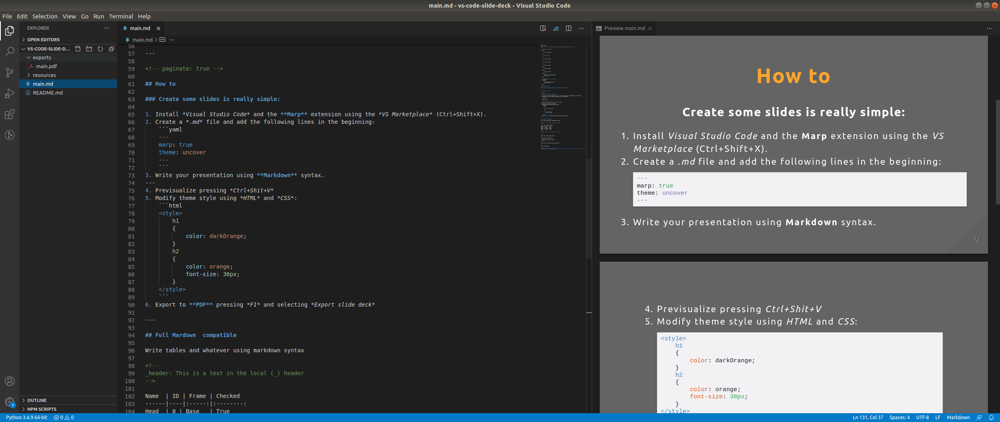

# Visual Studio Code - Markdown Slides Example

## Overview

This repository contains an example about how to use the extension [Marp](https://marp.app/) for [VS Code](https://code.visualstudio.com/) to create some slides quick and easily.

    

Use the own slides [PDF](exports/main.pdf) generated by [this example](main.md) as guidance to create your own presentation.

## References

* Marp for VS Code extension [[1]](https://github.com/marp-team/marp-vscode)
* Marp Core Repository [[2]](https://github.com/marp-team/marp-core)
* Original Markdown specifications [[3]](https://daringfireball.net/projects/markdown/syntax#p)